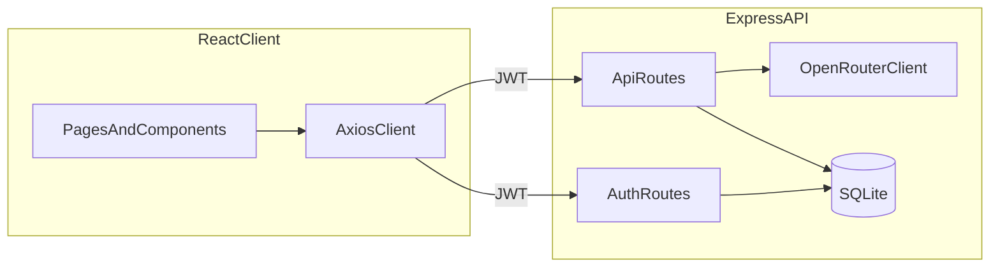

# Stepify

Stepify is a full-stack learning app that turns a topic or question into a short, step-by-step walkthrough with lightweight interactive elements. Authentication keeps each learner’s generation history private.

## Features

- Email and password signup and login with JSON Web Tokens
- Protected dashboard that calls the AI service through the backend (API keys stay server-side)
- Structured explanations with multiple interaction types: text, button demo, slider, motion highlight, and side-by-side comparison
- SQLite persistence for per-user generation history
- Responsive layout that works on mobile, tablet, and desktop

## Tech stack

| Layer    | Technology                          |
| -------- | ----------------------------------- |
| Frontend | React 18, Vite 5, Tailwind CSS 3, Framer Motion, React Router 6, Axios |
| Backend  | Node.js, Express 4, SQLite (sqlite3), bcryptjs, jsonwebtoken |
| AI       | OpenRouter chat completions (default: `google/gemma-3n-e4b-it:free`) |

## Folder structure

```
Stepify/
├── backend/                 # Express API
│   ├── config/              # OpenRouter client + JSON parsing helpers
│   ├── controllers/         # Auth and AI/history handlers
│   ├── middleware/          # JWT auth + error handler
│   ├── models/              # SQLite connection + schema bootstrap
│   ├── routes/              # /auth and /api route modules
│   ├── tests/               # Vitest + Supertest API smoke tests
│   ├── server.js            # App entry
│   └── .env.example
├── frontend/                # Vite React client
│   ├── public/
│   ├── src/
│   │   ├── components/      # Navbar, step UI, loading, error boundary
│   │   ├── context/         # Auth context + provider
│   │   ├── hooks/           # Shared async helper hook
│   │   ├── lib/             # Axios client + token wiring
│   │   └── pages/           # Landing, auth, dashboard
│   └── .env.example
├── MASTER_E2E_PROMPT.md     # Product specification reference
├── QUICK_REFERENCE.md       # Quick commands and integration notes
└── README.md                # This file
```

## Data flow



1. The user signs up or logs in. The API returns a JWT; the browser stores it in `localStorage` and Axios attaches it to subsequent calls.
2. The dashboard sends `POST /api/generate` with a topic. The backend calls OpenRouter, validates JSON, stores the payload in `history`, and returns the parsed explanation plus `historyId`.
3. The dashboard can reload prior items with `GET /api/history` and `GET /api/history/:id`.

## Prerequisites

- Node.js 18 or newer (global `fetch` is used on the server)
- npm 9+
- An [OpenRouter](https://openrouter.ai/) API key

## Setup

1. Clone the repository and install dependencies:

   ```bash
   npm install
   npm run install:all
   ```

2. Configure the backend environment:

   ```bash
   cp backend/.env.example backend/.env
   ```

   Edit `backend/.env` and set:

   - `JWT_SECRET` to a long random string
   - `OPENROUTER_API_KEY` to your key
   - Optional: `FRONTEND_URL` if you host the UI somewhere other than `http://localhost:5173`

3. Configure the frontend environment:

   ```bash
   cp frontend/.env.example frontend/.env
   ```

   Point `VITE_API_URL` at your API (default `http://localhost:5000`).

## Run locally

Start both servers from the repository root:

```bash
npm run dev
```

Or start them individually:

```bash
# Terminal 1
npm run dev --prefix backend

# Terminal 2
npm run dev --prefix frontend
```

- Frontend: `http://localhost:5173`
- Backend: `http://localhost:5000`
- Health check: `GET http://localhost:5000/health`

## API endpoints

| Method | Path | Auth | Description |
| ------ | ---- | ---- | ----------- |
| `POST` | `/auth/signup` | Public | Create a user. Body: `{ email, password, confirmPassword }` |
| `POST` | `/auth/login` | Public | Body: `{ email, password }` |
| `POST` | `/auth/logout` | Public | Stateless logout helper (client clears token) |
| `GET` | `/auth/profile` | Bearer JWT | Returns the current profile |
| `POST` | `/api/generate` | Bearer JWT | Body: `{ topic }`. Returns `{ success, data }` with `title`, `description`, `steps`, `historyId` |
| `GET` | `/api/history` | Bearer JWT | Lists recent history metadata |
| `GET` | `/api/history/:id` | Bearer JWT | Returns stored JSON for that entry |

Errors use `{ success: false, error: string }` with an appropriate HTTP status.

## Testing

```bash
npm test
```

Backend tests mock OpenRouter `fetch`, use an in-memory SQLite database, and exercise signup, login, generation, and history listing.

## Security notes

- Never commit real `.env` files or API keys. Use `.env.example` as a template only.
- If a key was ever pasted into documentation, rotate it in OpenRouter immediately.

## Troubleshooting

- **CORS errors**: Ensure `FRONTEND_URL` in `backend/.env` matches the origin shown in the browser address bar.
- **OpenRouter errors**: Confirm `OPENROUTER_API_KEY`, model name, and that `HTTP-Referer` / `X-Title` headers are allowed for your key tier.
- **JSON parse failures**: The backend extracts the first JSON object from the model output. If a model drifts from the contract, try a shorter topic or adjust the prompt in `backend/config/openrouter.js`.

## License

Private project scaffold for Stepify; add a license if you open-source the code.
